# AWAKENING

武汉科技大学RoboMaster崇实战队 视觉算法代码仓库

---

- 持续开发中，欢迎向我们提供本仓库的错误与问题，欢迎进行技术交流

## 写在前面

### 作者

- 刘璧洁 [MoCI-L](https://github.com/MoCI-L) 雷达识别/通信部分开发与维护
- 岳长鑫 [TRIAuAuAu](https://github.com/TRIAuAuAu) 英雄图传/工程机械臂规划（未在本仓库）
- 武晓健 [hyheiyue](https://github.com/hyheiyue) qq:1836871898 vx:hy_xiaojian 自动瞄准/能量机关/哨兵决策/哨兵导航（未在本仓库）/雷达识别/镖体、镖架制导（未在本仓库）

### 对本项目有帮助的RoboMaster开源项目或者个人（排名不分先后）

- 华南师范大学PIONEER战队@chenjunnn [rm_vision](https://github.com/chenjunnn/rm_vision)
- 中南大学FYT战队 [FYT2024_vision](https://github.com/CSU-FYT-Vision/FYT2024_vision)
- 河北科技大学Actor&Thinker战队 [at_vision](https://github.com/PraySky1337/at_vision) [Daedalus](https://github.com/Blackjack200/bevy_robomaster_simulator) [talos_2026](https://github.com/Blackjack200/talos_2026)
- 同济大学superpower战队 [sp_vision_25](https://github.com/TongjiSuperPower/sp_vision_25)
- 深圳北理莫斯科大学北极熊战队 [armor_detector_tensorrt](https://github.com/SMBU-PolarBear-Robotics-Team/armor_detector_tensorrt)
- 四川大学火锅战队 [openvino_armor_detector](https://github.com/Ericsii/rm_vision/tree/develop/openvino_armor_detector)
- 沈阳航空航天大学TUP战队 [opt-1208-001.onnx](https://github.com/tup-robomaster/TUP-Vision-2023-Based/blob/main/src/vehicle_system/autoaim/armor_detector/model/opt-1208-001.onnx)
- 北京科技大学Reborn战队 [number_classifier.onnx](https://github.com/RebornVision/Reborn-Vision-2024-armor-Inference/blob/main/model/number_classifier.onnx)
- 常州大学Climber战队 [Climber_Vision_26](https://github.com/CCZU-Climber/Climber_Vision_26)
- 华北理工大学Horizon战队 https://github.com/BreCaspian/ROBOMASTER-HORIZON-LiDAR-2025/releases/tag/2026.04.24
- 香港科技大学ENTERPRIZE战队 [RM2025-Radar-Algorithm](https://github.com/hkustenterprize/RM2025-Radar-Algorithm)
- 南京理工大学Alliance战队 https://github.com/Alliance-Algorithm
- 五大湖联合大学The Great Lakes 战队 [Pacific_doorlock_sniper](https://github.com/wele0612/Pacific_doorlock_sniper)
- 深圳大学RobotPilots战队 [RobotDetectionModel](https://github.com/broalantaps/RobotDetectionModel)
- 华中科技大学狼牙战队 [HUST_HeroAim_2024](https://github.com/HUSTLYRM/HUST_HeroAim_2024)
- 吉林大学TARS Go战队 [jlu_vision_26](https://github.com/Fskaaaaaaaa/jlu_vision_26)
- 华南理工大学华南虎战队 [rm_vision_core](https://github.com/scutrobotlab/rm_vision_core) [rmvl](https://github.com/cv-rmvl/rmvl)
- 哈尔滨工业大学（深圳）南工骁鹰战队 [radar_ros_ws](https://github.com/PageChen04/radar_ros_ws)
- 东北大学TDT战队 [T-DT-2024-Radar](https://github.com/T-DT-Algorithm-2024/T-DT-2024-Radar) [T-DT_Radar](https://github.com/T-DT-Algorithm-2025/T-DT_Radar)
- 福建理工大学仓侠战队 [PowerRuneSimulator](https://github.com/iowqi/PowerRuneSimulator)
- 上海交通大学交龙战队 [adaptive_ekf.hpp](https://github.com/julyfun/rm.cv.fans/blob/main/aimer/base/math/filter/adaptive_ekf.hpp)
- 武汉工程大学Nautilus战队 费钰涵
- 江苏开放大学开拓者战队 刘俊豪
- 江苏大学Aurora战队 聂政华

### 前作

[wust_vision](https://github.com/WUST-RM/wust_vision)

## 亮点

- 集成自动瞄准、能量机关、全向感知、哨兵决策、雷达识别，方便通用算法与代码复用，便于统一管理与调试
- 高性能：以自动瞄准算法为例，在intel nuc 1240P平台做到全流程（包括相机取流解码，神经网络推理，cv算法识别，滤波器更新预测等，下同）250hz（工业相机上限）吞吐，平均6-8ms延迟，nvidia orin nx 8g做到 250hz吞吐，2-5ms延迟
- 无复杂依赖，易部署（一台只配置过操作系统的minipc从0配置只需要不到半小时即可做到上场水平，别问为什么知道）
- 算法实现与应用层分离，可针对不同兵种不同车型不同需求定制不同的运行时代码
- 适配[Daedalus](https://github.com/Blackjack200/bevy_robomaster_simulator)，可一键无痛算法验证

## 部署

### 依赖

- C++23 编译器 + cmake + ninja（`run.sh` 默认使用 clang/clang++）
- OpenCV
- [OpenVINO](https://flowus.cn/7a2a3341-74a1-4db9-bced-99fe5d05ab75)（2024.0.0+）/[TensorRT-cuda](https://flowus.cn/e98af178-de0b-4546-808d-a6f1ff199d62)(TensorRT 10.6.0.26 cuda 12-6)
- fmt
- ceres
- Eigen3
- nlohmann
- yaml-cpp
- spdlog
- HikSDK/MvSDK
- ROS2（可选）
- Rerun C++ SDK 0.32+（可选，推荐用于统一图像、时序数据和三维 TF 可视化）

### quick-start

```bash
git clone --recurse-submodules https://github.com/WUST-RM/awakening.git
cd awakening
sudo ./run.sh build
sudo ./run.sh run standard omni true
python3 web.py #运行远程可视化web（雷达识别不适用）
```

`run.sh` 支持：

```bash
sudo ./run.sh build                  # 配置并增量构建
sudo ./run.sh rebuild                # 删除 build 后全量重构
sudo ./run.sh run <program> [args]   # 构建后运行
sudo ./run.sh race <program> [args]  # 不构建，直接运行 bin 下程序
sudo ./run.sh debug <program> [args] # 构建后使用 gdb 启动
```

## 自动瞄准/能量机关

### 自动瞄准/能量机关整体流程图

```mermaid
flowchart TD
    Start["运行时入口"] --> LoadCfg["加载 YAML 配置<br/>mode / enemy_color / bullet_speed<br/>camera / serial / detector / tracker / aimer"]
    LoadCfg --> IOInit["初始化 IO<br/>HikCamera 或 Daedalus SHM<br/>SerialDriver / VideoSaver / ROS2 / Web"]
    IOInit --> RuntimeLoop["调度循环<br/>图像帧 + 串口帧 + TF + 时间戳"]

    RuntimeLoop --> ModeSwitch{"当前模式"}
    ModeSwitch -->|"AUTO_AIM"| AA0
    ModeSwitch -->|"AUTO_BUFF"| RB0

    subgraph AA["自动瞄准 Auto Aim"]
        direction TB
        AA0["图像输入<br/>ImageFrame / CameraInfo / camera_cv_in_odom"] --> AA1["确定检测 ROI<br/>若目标稳定: ArmorTarget::get_net_focus_roi<br/>否则使用全图"]
        AA1 --> AA2["ArmorDetector::detect"]
        AA2 --> AA21["网络检测<br/>OpenVINO / TensorRT<br/>ROI letterbox / preprocess / infer / decode"]
        AA2 --> AA22["传统 CV 灯条检测<br/>颜色阈值 / 亮度分割 / 轮廓筛选 / 灯条配对"]
        AA21 --> AA3["结果坐标还原<br/>transform_matrix + ROI offset"]
        AA22 --> AA3
        AA3 --> AA4["数字分类与颜色分类<br/>number classifier / enemy_color 过滤"]
        AA4 --> AA5["输出 Armors / Lights<br/>附带关键点 / 类别 / 置信度 / 时间戳"]

        AA5 --> AT0["ArmorTracker::track"]
        AT0 --> AT1{"cur 是否 LOST?"}
        AT1 -->|"是"| AT2["init_target"]
        AT2 --> AT21["选择有效装甲板<br/>过滤 NONE / PURPLE / 低质量目标"]
        AT21 --> AT22["IPPE PnP 初始化装甲板位姿<br/>前哨站做 yaw 搜索修正"]
        AT22 --> AT23["由装甲板位姿 + 预设半径<br/>反推整车位姿"]
        AT23 --> AT24["初始化 ArmorTarget ESEKF<br/>x = cx vcx cy vcy cz vcz rot_z vyaw log_r1 log_r2 h rot_y rot_x"]
        AT24 --> AT25["初始化目标编号 / frame_id / last_update<br/>TrackState -> DETECTING"]

        AT1 -->|"否"| AT3["update_target"]
        AT3 --> AT31["按已跟踪目标数字过滤候选装甲板<br/>保留同类且颜色有效观测"]
        AT31 --> AT32["predict_ekf<br/>常速度平移 + SO(3) 右乘 yaw 增量<br/>姿态右乘误差线性化"]
        AT32 --> AT33["生成整车几何预测<br/>T_car_odom = t(cx,cy,cz) * Exp_SO3(rot)<br/>逐编号生成 T_armor_odom"]
        AT33 --> AT34["match_armor"]
        AT34 --> AT341["按法向可见性选取最多 3 块预测装甲板"]
        AT341 --> AT342["预测左右灯条端点<br/>组成装甲板四点轮廓"]
        AT342 --> AT343["与检测四点比较<br/>中心误差 / 边角度误差 / 周长比例误差"]
        AT343 --> AT344["加权代价门控 + greedy_match<br/>得到 matched_armors"]

        AT344 --> AT35["match_light"]
        AT35 --> AT351{"是否已有完整装甲板匹配<br/>且目标非基地?"}
        AT351 -->|"否"| AT354["matched_lights 为空"]
        AT351 -->|"是"| AT352["按法向选择最可见装甲板<br/>预测自身左右灯条 + 相邻单灯条"]
        AT352 --> AT353["长度比例门控 / 角度门控 / 位置门控<br/>以端点位置差为代价贪心匹配"]
        AT353 --> AT36["ArmorTarget::update"]
        AT354 --> AT36

        AT36 --> AT361{"matched_armors 是否为空?"}
        AT361 -->|"是"| AT365["本帧不更新 ESEKF<br/>仅推进跟踪状态机"]
        AT361 -->|"否"| AT362["完整装甲板拆成左右灯条 UVL 观测<br/>每条观测: angle center_x center_y length"]
        AT362 --> AT363["单独灯条构造 UVL 观测<br/>未被完整装甲板占用时参与更新"]
        AT363 --> AT364["单完整装甲板额外加入左右灯条深度差观测<br/>update_multi 最小化重投影几何残差"]
        AT364 --> AT366["更新整车状态 / 协方差 / last_update<br/>写入 Web armor_target 日志"]
        AT365 --> AT37["update_fsm"]
        AT366 --> AT37

        AT37 --> AT371{"cur 是否 TEMP_LOST?"}
        AT371 -->|"是"| AT372["尝试备用目标 pre<br/>遮挡 / 误检 / 目标切换恢复"]
        AT372 --> AT373{"pre 是否 TRACKING?"}
        AT373 -->|"是"| AT374["交换 cur / pre"]
        AT373 -->|"否"| AT376["保持 cur"]
        AT371 -->|"否"| AT375{"cur 是否 TRACKING?"}
        AT375 -->|"是"| AT377["重置 pre 为 LOST"]
        AT375 -->|"否"| AT376
        AT374 --> AAOut["输出 ArmorTarget<br/>整车状态 / 装甲板位姿 / 跟踪状态"]
        AT376 --> AAOut
        AT377 --> AAOut

        AAOut --> AAControl["VeryAimer::aim"]
        AAControl --> AAC1["预测命中时刻目标状态<br/>考虑弹丸飞行时间 / 发射延迟"]
        AAC1 --> AAC2["select_armor<br/>根据可见性 / 距离 / 高度 / 模式选择目标装甲板"]
        AAC2 --> AAC3["弹道解算<br/>由 shoot 坐标系目标点求 yaw / pitch"]
        AAC3 --> AAC4["生成未来控制点序列<br/>ControlPoint: yaw pitch aim_id aim_point"]
        AAC4 --> AAC5["LimitTrajectory<br/>五次多项式闭式求解<br/>解析检查 yaw/pitch 最大加速度"]
        AAC5 --> AAC6["输出控制指令<br/>yaw / pitch / v_yaw / v_pitch / fire"]
    end

    subgraph RB["能量机关 Auto Buff"]
        direction TB
        RB0["图像输入<br/>ImageFrame / CameraInfo / camera_cv_in_odom"] --> RB1["RuneDetector::detect"]
        RB1 --> RB11["网络/CV 检测 R 标 / 扇叶 / 靶盘<br/>关键点整理 / 颜色过滤"]
        RB11 --> RB2["输出 RuneDetection<br/>rune_rs / fan_blades / fan_targets"]

        RB2 --> RT0["RuneTracker::track"]
        RT0 --> RT1{"是否已有有效 RuneTarget?"}
        RT1 -->|"否"| RT2["init_target"]
        RT2 --> RT21["选择初始化观测<br/>优先使用带 R 扇叶<br/>否则使用靶盘 + R 标"]
        RT21 --> RT22["扇叶或靶盘 PnP<br/>求解能量机关平面位姿"]
        RT22 --> RT23["初始化 RuneTarget ESEKF<br/>x = cx cy cz yaw roll v_roll tau a w"]
        RT23 --> RT24["初始化 Voter<br/>方向 Collecting<br/>模式 Small / Big 参数保留"]
        RT24 --> RT25["TrackState -> DETECTING"]

        RT1 -->|"是"| RT3["update_target"]
        RT3 --> RT30{"本帧是否有 R 标 / 扇叶 / 靶盘观测?"}
        RT30 -->|"否"| RT90["found = false<br/>只更新状态机"]
        RT30 -->|"是"| RT31["predict_ekf"]
        RT31 --> RT311{"Voter 状态"}
        RT311 -->|"Collecting"| RT312["用 v_roll 外推 roll"]
        RT311 -->|"Clockwise / Counterclockwise"| RT313["按方向推进 roll"]
        RT313 --> RT314{"Voter 模式"}
        RT314 -->|"Small"| RT315["小符固定角速度"]
        RT314 -->|"Big"| RT316["大符正弦角速度<br/>用 a / w / tau 积分相位"]
        RT312 --> RT32
        RT315 --> RT32
        RT316 --> RT32

        RT32["match_fan"] --> RT321["候选扇叶 PnP 粗定位<br/>构造 YPD + rot_yaw + rot_roll"]
        RT321 --> RT322["与 5 个预测扇叶编号计算马氏距离<br/>match_gate 门控"]
        RT322 --> RT323["greedy_match<br/>得到 matched_fans"]

        RT323 --> RT33["match_r"]
        RT33 --> RT331["融合预测 R 点与 matched_fans 内部 R 点<br/>计算 avg_r 和平均臂长"]
        RT331 --> RT332{"是否检测到合法独立 R 标?"}
        RT332 -->|"是"| RT333["使用 CV 检测 R 标中心<br/>标记该 R 非废弃"]
        RT332 -->|"否"| RT334{"是否有 matched_fans?"}
        RT334 -->|"是"| RT335["使用扇叶内部 R 点均值<br/>作为弱 R 观测"]
        RT334 -->|"否"| RT336["本帧不使用 R 观测"]

        RT333 --> RT34["match_fan_target"]
        RT335 --> RT34
        RT336 --> RT34
        RT34 --> RT341{"是否有可用 R 中心?"}
        RT341 -->|"否"| RT342["无法可靠排序靶盘角点<br/>matched_fan_targets 为空"]
        RT341 -->|"是"| RT343["以 R 中心排序靶盘角点"]
        RT343 --> RT344["靶盘 PnP 粗定位<br/>构造 YPD + rot_yaw + rot_roll"]
        RT344 --> RT345["与 5 个预测扇叶编号门控匹配"]
        RT345 --> RT346["greedy_match<br/>得到 matched_fan_targets"]

        RT342 --> RT35["RuneTarget::update"]
        RT346 --> RT35
        RT35 --> RT351["R 中心加入 R_X / R_Y 二维像素观测"]
        RT351 --> RT352["matched_fans 加入扇叶四点观测<br/>TOP / LEFT / BOTTOM / RIGHT"]
        RT352 --> RT353["matched_fan_targets 加入靶盘五点观测<br/>四角点 + 中心点"]
        RT353 --> RT354["update_multi<br/>拼接 R 标 / 扇叶 / 靶盘观测<br/>最小化重投影残差"]
        RT354 --> RT355["更新位置 / yaw / roll / v_roll / tau / a / w"]
        RT355 --> RT356["更新可见扇叶集合 fan_wc"]
        RT356 --> RT357["根据 roll 连续变化更新 Voter 方向投票"]
        RT357 --> RT358["多扇叶或多靶盘观测累计 Big 模式证据"]
        RT358 --> RT359["满足阈值后 voter.mode -> Big"]
        RT359 --> RT36["update_fsm"]
        RT90 --> RT36

        RT36 --> RT361{"目标距离是否异常?"}
        RT361 -->|"是"| RT362["强制 LOST"]
        RT361 -->|"否"| RT363{"是否连续稳定跟踪?"}
        RT363 -->|"是"| RT364["TRACKING"]
        RT363 -->|"否"| RT365["DETECTING / TEMP_LOST / LOST 状态迁移"]
        RT362 --> RBOut["输出 RuneTarget<br/>状态 / voter / 可见扇叶 / 大符参数"]
        RT364 --> RBOut
        RT365 --> RBOut

        RBOut --> RBControl["RuneAimer::aim"]
        RBControl --> RBC1["预测命中时刻 roll<br/>小符匀速 / 大符 a,w,tau 正弦模型"]
        RBC1 --> RBC2["选择待击打扇叶编号<br/>计算靶盘中心与提前量"]
        RBC2 --> RBC3["弹道解算 yaw / pitch"]
        RBC3 --> RBC4["LimitTrajectory 平滑控制轨迹"]
        RBC4 --> RBC5["输出打符控制指令<br/>yaw / pitch / fire"]
    end

    AA1 -.->|稳定目标反馈 ROI| AA2
    AA6["自动瞄准控制包"] --> Send["PacketTypedefSend<br/>串口发送 / 仿真接口"]
    AAC6 --> AA6
    RBC5 --> RB6["能量机关控制包"]
    RB6 --> Send
    AAOut --> Web["Web / ROS2 可视化<br/>目标状态 / 观测 / 控制量 / 延迟"]
    RBOut --> Web
    RuntimeLoop --> Record["可选录像与日志<br/>record/ log/ web json"]
```



### 高效多观测“整车”状态估计

RoboMaster 机器人受机械结构和规则约束，装甲板在车体上呈现稳定的几何排列：同一辆车上的多块装甲板不是相互独立的目标，而是同一个刚体上的多个观测面。能量机关也具有类似结构，靶盘、中心 R 标和叶片之间存在固定机械约束。因此，视觉系统如果只跟踪单块装甲板，会丢失大量可利用的先验；更合理的做法是估计目标整体状态，再把不同观测统一投影到同一个几何模型上。

自动瞄准链路位于 `src/tasks/auto_aim/`。其中 `armor_detect` 负责神经网络/CV 装甲板检测、数字分类、颜色分类和 ROI 推理；`armor_track` 负责整车状态估计、装甲板/灯条匹配和多观测 ESEKF 更新；`armor_control` 负责弹道解算、装甲板选择、云台轨迹规划和开火判断。运行时由 `standard`、`sentry`、`hero` 等入口按配置组装相机、串口、检测、跟踪、控制和 Web 日志链路。

实际场景中主要会遇到几个问题：

- 单帧有效观测偏少。目标高速旋转、侧身或被遮挡时，完整装甲板可能只有一块可用，但相邻单灯条仍携带位置、尺度和朝向信息。
- PnP 位姿容易抖动。远距离小目标、角点回归误差、斜视角和共面矩形目标都会让深度和姿态估计不稳定。
- 目标不一定只在 odom 系下做 yaw 旋转。实车车体平面、地面坡度、云台外参和前哨站/基地结构都会让简单平面模型出现系统误差。
- 同一帧可能存在多个有效观测。若只选一个目标更新，剩余装甲板和灯条信息会被浪费。

针对这些问题，本项目使用基于图像点重投影的多观测“整车”状态估计。算法不把每块装甲板视为独立目标，而是先维护一个车体级状态，再根据整车几何预测各编号装甲板和灯条在图像中的位置，最后用实际检测到的图像点反向修正整车状态。

跟踪器使用误差状态扩展卡尔曼滤波器 `ErrorStateEKF`。状态定义在 `src/tasks/auto_aim/armor_track/motion_model.hpp`：

```text
x = [cx, vcx, cy, vcy, cz, vcz, rot_z, vyaw, log_r1, log_r2, h, rot_y, rot_x]^T
```

其中 `c = (cx, cy, cz)` 表示整车中心位置，`v = (vcx, vcy, vcz)` 表示整车速度。`rot_x/rot_y/rot_z` 共同描述车体姿态的 `SO(3)` 旋转向量，`vyaw` 表示绕车体系 z 轴的角速度，用于预测阶段推进 yaw 方向运动。`log_r1/log_r2` 表示装甲板到车体中心半径的对数形式，普通四装甲目标用奇偶编号区分长短半径，`h` 描述另一组装甲板的高度差。前哨站复用 `log_r1/log_r2/h` 中的后两个槽位作为 `OUTPOST01DZ/OUTPOST02DZ`，并把半径约束到固定前哨站半径。基地和前哨站目标采用退化模型，约束 `rot_x/rot_y`，只估计主要 yaw 方向。

当前车体位姿生成顺序为：

```text
T_car_odom.translation = [cx, cy, cz]^T
R_car_odom = Exp_SO3([rot_x, rot_y, rot_z])
```

预测时先由旋转向量恢复 `R_car_odom`，再右乘 `Exp_SO3([0, 0, vyaw * dt])` 推进车体姿态。当前实现对姿态使用右乘 `SO(3)` 误差注入，平移、速度、半径和高度等状态仍使用欧氏加法：

```text
R_car_odom <- R_car_odom * Exp_SO3(delta_rot)
p_car_odom <- p_car_odom + delta_p
delta_rot = Log_SO3(R_nominal^T * R_value)
```

这里 `inject(delta, x)` 表示把误差状态注入名义状态，`box_minus(x_nominal, x_value)` 表示从两个名义状态反推出误差状态。普通欧氏状态直接相加/相减，姿态误差使用 `Log_SO3(R_nominal^T * R_value)` 表达。二者是一组互逆关系：

```text
x_value = inject(delta, x_nominal)
delta   = box_minus(x_nominal, x_value)
```

右乘姿态扰动的核心作用，是让姿态误差作用在目标自身的切空间内，避免把旋转向量当作普通三维欧氏量直接相减。采用该误差定义后，`ErrorStateEKF` 通过 `inject / box_minus` 对预测误差传播 `F` 和多观测更新 `H` 做数值线性化，使协方差、残差和注入操作保持在同一误差坐标中。

预测传播时，滤波器先扰动上一时刻名义状态，再分别预测，并用 `box_minus` 把两个预测结果的差转换回当前误差坐标：

```text
x_pert      = inject(delta_i, x_prev)
x_pred      = f(x_prev)
x_pert_pred = f(x_pert)
F_i         = box_minus(x_pred, x_pert_pred) / eps
```

多观测更新时，滤波器同样对误差状态做中心差分，得到与当前注入方式一致的观测雅可比 `H`。相比直接把旋转向量当作普通三维量做差，这种方式计算量更高，但避免了姿态注入和欧氏雅可比混用造成的不一致。

过程噪声分为平移和姿态两部分。平移加速度噪声按 car 坐标系前后、左右、上下配置，构造 `Q` 时先通过当前车体姿态旋转到 odom 坐标系，再按常加速度模型填入位置、速度和交叉项：

```text
Q_accel_car  = diag(q_xyz)
Q_accel_odom = R_car_odom * Q_accel_car * R_car_odom^T
Q_p_p = 1/4 dt^4 Q_accel_odom
Q_p_v = 1/2 dt^3 Q_accel_odom
Q_v_p = 1/2 dt^3 Q_accel_odom
Q_v_v = dt^2 Q_accel_odom
```

姿态误差同样位于 car 切空间。模型只显式估计 `vyaw`，因此 yaw 角加速度噪声按绕车体系 z 轴的常角加速度模型填入 `rot_z / vyaw` 块：

```text
Q_rot_z_rot_z += 1/4 dt^4 q_yaw
Q_rot_z_vyaw  += 1/2 dt^3 q_yaw
Q_vyaw_vyaw += dt^2 q_yaw
```

`q_wpr` 作为非 yaw 姿态漂移强度，以 `dt * q_wpr` 的形式加到 `rot_x/rot_y` 对角项，用于吸收车体 roll/pitch 小幅误差、地面坡度和外参残差。这个设计保留了单一 `vyaw` 的轻量运动模型，同时让姿态注入、过程噪声和滤波线性化保持在一致的误差定义中。

对于第 `i` 块装甲板，其相对车体中心的位置由整车状态直接给出：

```text
theta_i = i * 2pi / armor_num
r_i = exp(log_r1) 或 exp(log_r2)
p_i_car = [-r_i cos(theta_i), -r_i sin(theta_i), dz_i]^T
R_armor_car = Rz(theta_i) * Ry(armor_pitch)
T_armor_odom = T_car_odom * T_armor_car
```

普通四装甲目标中奇数编号使用 `log_r2` 和高度差 `h`，偶数编号使用 `log_r1` 且高度差为 0；前哨站的 1、2 号装甲板使用独立高度偏移。这一步把“装甲板跳变”转化为确定的刚体几何关系。无论当前看到的是正面装甲板、侧面装甲板，还是相邻装甲板的一条灯条，它们本质上都是同一个整车状态在不同位置上的投影。只要观测能匹配到对应编号，就可以共同约束同一个状态向量。

观测模型直接工作在图像平面。对某块装甲板或某条灯条，算法根据当前状态生成对应三维位姿，再通过相机模型投影到图像坐标：

```text
z_hat = project(camera, T_camera_odom^-1 * T_armor_i(x) * P)
residual = z_observed - z_hat
```

这里 `z_observed` 是检测器给出的真实灯条端点整理出的观测，`z_hat` 是当前整车状态预测出的图像位置。实现中每条灯条会被转换为 `UVL = [angle, center_x, center_y, length]`，角度残差做 `+-pi` 归一化；完整装甲板在更新时会拆成左右两条灯条 UVL 观测，单独灯条也可以作为局部观测参与更新。滤波器最小化的不是 PnP 后的三维位姿误差，而是更接近传感器原始测量的图像重投影几何残差。

当本帧只有一块完整装甲板完成匹配时，单靠这块装甲板拆出的两条 UVL 观测容易出现退化：图像上的中心、长度和角度可以约束投影形状，但对装甲板左右两侧谁更靠近相机、整车 yaw/roll/pitch 应该如何分摊并不总是敏感。此时滤波器可能更依赖上一时刻预测，把状态沿时间方向“带过去”，在切板或大角度斜视时表现为姿态被预测误导。

为补上这个约束，`ArmorTarget::update()` 在 `matched_armors.size() == 1` 且 `armor_pnp()` 成功时，会额外构造一个一维 `DiffMeasure`。它先用 IPPE 解出当前完整装甲板在相机坐标系下的位姿，再计算左、右灯条中心点的深度差：

```text
depth_diff = z(left_light_center_in_camera) - z(right_light_center_in_camera)
```

这个量不直接把 IPPE 的完整三维位姿写进滤波器，只取“左右灯条哪个更靠前、相差多少”这一维几何信息。滤波器的预测观测同样由当前整车状态生成左右灯条中心深度差，然后用 `depth_diff` 残差更新状态；观测噪声由 `r_sigma_armor_lights_depth_diff` 配置。这样可以在单装甲板场景下给车体姿态增加一个独立约束，抑制共面 PnP 和纯图像重投影在斜视角下的歧义，同时避免过度相信 IPPE 的绝对位置和姿态。

从数学上看，多观测更新可以写成：

```text
z = [z_1, z_2, ..., z_n]^T
h(x) = [h_1(x), h_2(x), ..., h_n(x)]^T
residual = z - h(x)
```

扩展卡尔曼滤波器在当前状态附近对 `h(x)` 线性化，得到观测雅可比 `H`，再根据观测噪声 `R` 和状态协方差 `P` 计算卡尔曼增益：

```text
K = P H^T (H P H^T + R)^-1
delta_x = K (z - h(x))
x <- inject(delta_x, x)
```

这里的 `delta_x` 是误差状态，不是普通状态增量。对姿态部分，`delta_x` 中的 `delta_rot` 会通过 `Exp_SO3` 右乘到整车姿态；对位置、速度、半径和高度等欧氏量，则继续使用普通加法注入。

当一帧中加入更多有效观测时，`H^T R^-1 H` 提供的信息量增加，后验状态的不确定性会下降。也就是说，同时利用装甲板和灯条不是简单堆叠特征点，而是在滤波框架内增加了对整车状态的独立约束。

为避免错误观测进入滤波器，跟踪器使用门控贪心匹配。完整装甲板匹配时，算法先根据预测装甲板在相机坐标系下的法向可见性选出最多 3 个候选编号，再把每个候选编号的左右灯条端点投影成四点轮廓，与检测四点计算中心误差、边角度误差和周长比例误差；三项按配置权重加权后进入门控和 `greedy_match`。当前实现中 IPPE PnP 主要用于初始化和单完整装甲板的深度差观测，不再作为常规编号匹配的核心代价。单独灯条则根据预测端点检查长度、倾角和位置门限，并以端点距离作为匹配代价。只有通过门控的装甲板和灯条才会进入 `update_multi`。

因此，本项目的“整车”状态估计不是简单的“先 PnP 再滤波”，而是把整车几何约束前移到观测模型中：由整车状态直接生成装甲板和灯条的图像预测，再用真实图像点反向修正整车状态。在比赛场景中，这种设计带来更高的观测利用率、更稳定的切板过程，以及更好的遮挡和远距离鲁棒性。

### 基于“整车”状态先验的显式空间注意力机制

大多数RoboMaster 视觉算法使用的神经网络模型都采用固定尺寸输入，需要在输入神经网络前通常需要对工业相机图像进行缩放、填充或裁剪。常见做法是使用 `letterbox`：在保持原图长宽比的前提下，将图像缩放到网络输入尺寸，再用 `padding` 补齐空白区域。该方法能避免几何形变，但也带来一个问题：工业相机图像的长宽比通常与网络输入长宽比不一致，整幅图经过 `letterbox` 后往往会被整体缩小，远距离装甲板本来只占很少像素，缩放后有效纹理和边缘信息进一步减少，导致关键点回归、分类和置信度都会下降。

我们利用“整车”状态估计提供的几何先验，在检测阶段引入一种显式的空间注意力机制。不再把整张图像无差别地送入检测器，而是根据当前整车状态、相机外参和时间戳预测，将目标在当前图像中的可能区域重投影出来，并构造随跟踪置信度自适应变化的 ROI。这样网络输入关注的是目标高概率出现区域，而不是包含大量背景的整幅图像。

代码中这一逻辑由 `ArmorTarget::get_net_focus_roi()` 提供。目标跟踪稳定后，`expanded()` 会预测所有装甲板左右灯条端点在图像中的位置，生成包围框并进行比例扩展；随后先按网络输入宽高比修正 ROI，再扩成方形搜索区域。若目标长时间未更新，ROI 会按 `lost_time_thres` 从当前预测区域逐步扩大到整图，避免预测漂移后彻底丢失目标。应用层会把这个 ROI 传给 `ArmorDetector`，网络推理在 ROI 内执行，检测结果再通过变换矩阵和 ROI 偏移回到原图坐标。

对于神经网络识别链路，这种 ROI 机制有两个直接收益。第一，ROI 的长宽比可以主动匹配网络输入，减少 letterbox padding 和无效背景区域，使输入像素更多用于描述目标本身。第二，当目标距离较远时，ROI 裁剪后再 resize 到网络输入尺寸，相当于对目标区域进行局部放大，保留并增强远距离小目标的灯条边缘、数字区域和角点结构。

对于传统 CV 算法识别链路，同样可以利用整车先验构造更小的 ROI。传统灯条检测通常依赖颜色阈值、亮度分割、轮廓提取、形态筛选和灯条配对，搜索区域越大，环境灯光等干扰越容易进入候选集，同时 CPU 开销和误匹配概率也会增加。根据整车状态直接预测各装甲板灯条端点在图像中的位置，生成紧凑的 ROI，使传统算法只处理目标附近区域，从源头减少无效候选，降低CPU 压力，并提升处理速度和匹配稳定性。

### 大能量机关拟合

得益于高效的“整车”观测实现，本项目直接将大能量机关的`a`、`w`、`t`写入状态量，在预测过程推进`t`，利用较小的随机游走噪声动态调整`a`、`w`、`t`，不依赖滑动窗口最小二乘，处理速度快，收敛稳定。

### 类 MINCO 思想的开环轨迹规划

自动瞄准和能量机关控制中都存在目标控制点突变的问题：自动瞄准切换装甲板时，目标 yaw/pitch 会出现不连续；能量机关预测命中点也需要在未来一段时间内给出可执行的云台轨迹。如果直接把瞬时目标点发给下位机，控制器会在切换点承受过大的速度和加速度需求，表现为跟随抖动或开火窗口变窄。

本项目在 `src/tasks/base/dta_utils.hpp` 中实现了 `LimitTrajectory`，用于生成轻量级开环前馈轨迹。它借鉴了“固定几何点、解析求解多项式系数、主要搜索时间分配”的参数化思想：控制点位置不作为优化变量，五次多项式系数由边界状态闭式求解，在线规划只调整切板附近的时间覆盖范围。

具体来说，系统首先在当前时刻前后采样一段目标射击轨迹。每个采样点由目标状态预测、弹道解算和目标选择共同确定，得到对应的云台 `yaw`、`pitch` 控制点。随后规划器对这些控制点估计节点速度和加速度，并在相邻节点之间构造五次多项式段：

```text
p(t) = c0 + c1 t + c2 t^2 + c3 t^3 + c4 t^4 + c5 t^5
```

五次多项式可以同时满足起点和终点的位置、速度、加速度约束：

```text
p(0), v(0), a(0), p(T), v(T), a(T)
```

因此每一段轨迹天然具有位置、速度和加速度连续性。实现上不需要求解通用优化问题，只需要根据边界条件直接计算 `c0` 到 `c5`。这使得轨迹生成过程稳定、确定、计算量小，也避免了在线 QP 或 MPC 求解器带来的额外依赖。

难点集中在切板点。切换装甲板时，目标控制点会发生突变，若仍使用原始采样间隔生成多项式，过渡段会得到超过云台能力的加速度。`LimitTrajectory` 会先找到当前时间附近最近的切板区间，然后以该区间为中心，不改变控制点位置，只向左右扩大过渡段覆盖的时间范围。时间越长，同样的位置变化被分摊到更长时间内完成，所需加速度越低。规划器不断扩大该过渡段，直到解析计算得到的最大加速度满足配置约束：

```text
max |a_yaw(t)|   <= max_yaw_acc
max |a_pitch(t)| <= max_pitch_acc
```

这里的最大加速度不是靠密集采样粗略估计，而是由多项式解析计算。对于五次位置多项式，其加速度是三次函数，jerk 是二次函数。加速度极值只可能出现在区间端点或 jerk 为零的内部点。实现中通过求解 jerk 的根来检查这些候选点，从而得到该段轨迹的最大绝对加速度。这比固定步长扫描更精确，也更适合高频在线规划。

从控制角度看，这是一种开环前馈轨迹规划器。它根据目标预测轨迹提前生成未来一段时间的 `yaw`、`pitch`、速度和加速度指令，下位机控制器可以将这些速度、加速度作为前馈量，与自身闭环误差控制叠加，从而降低切板时的控制压力。

从开火决策角度看，规划后的控制轨迹和原始射击轨迹可以同时被查询。系统不仅能判断当前云台是否位于可命中窗口内，还能考虑发射延迟，在未来若干时刻检查控制轨迹与射击轨迹的偏差。如果延迟区间内轨迹误差会超过装甲板可命中范围，则提前禁止开火。这使开火逻辑从经验阈值判断转向轨迹一致性判断。
